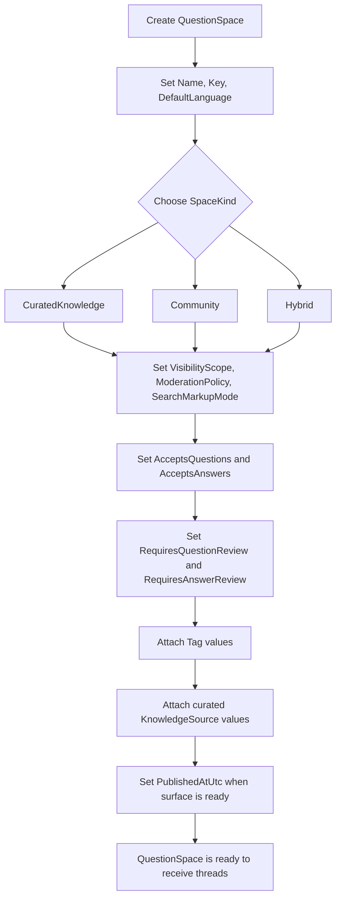

# Flow 01: Space Setup And Governance

This flow defines how a Q&A surface is created before any thread exists.

## Visual flow

## Entities involved

| Entity | Role in the flow | Important members |
| --- | --- | --- |
| [QuestionSpace](../Domain/QuestionSpace.cs) | Top-level container for the Q&A surface. | `Name`, `Key`, `DefaultLanguage`, `Kind`, `Visibility`, `ModerationPolicy`, `SearchMarkupMode`, `AcceptsQuestions`, `AcceptsAnswers`, `RequiresQuestionReview`, `RequiresAnswerReview`, `PublishedAtUtc` |
| [Tag](../Domain/Tag.cs) | Taxonomy attached to the space for routing and discovery. | `Name` |
| [KnowledgeSource](../Domain/KnowledgeSource.cs) | Curated sources that the space trusts or reuses by default. | `Kind`, `Locator`, `SystemName`, `IsAuthoritative`, `LastVerifiedAtUtc` |

## Enums involved

| Enum | What it decides |
| --- | --- |
| [SpaceKind](../Domain/Enums/SpaceKind.cs) | Whether the space behaves as curated, community-first, or hybrid. |
| [VisibilityScope](../Domain/Enums/VisibilityScope.cs) | Who can see the space once it is live. |
| [ModerationPolicy](../Domain/Enums/ModerationPolicy.cs) | Whether questions and answers need review before or after exposure. |
| [SearchMarkupMode](../Domain/Enums/SearchMarkupMode.cs) | Whether the surface behaves like a collection, a canonical question page, both, or neither from a search perspective. |

## Interaction notes

- `QuestionSpace` is the primary grouping entity for all future `Question` threads.
- `Tag` is classification, not containment. It cuts across spaces and threads.
- `KnowledgeSource` at the space level is a reusable trust pool, not yet evidence for a specific question or answer.
- The sample does not include a dedicated space-level audit journal yet. Governance at this level is represented through the configured fields on `QuestionSpace`.
