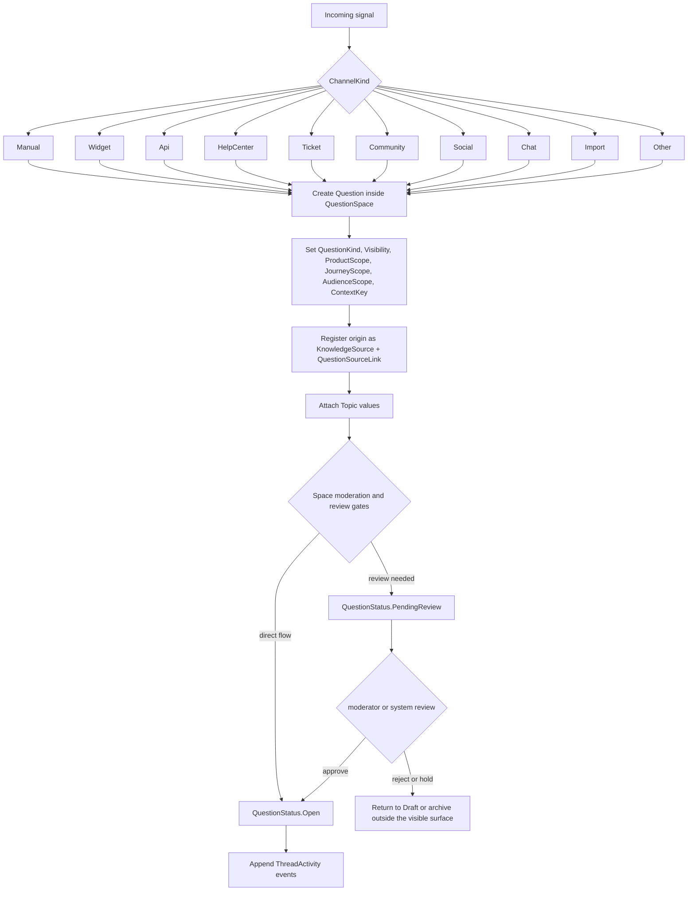

# Flow 02: Question Intake And Routing

This flow explains how a new question enters the system, how its origin is captured, and how moderation and routing start.

## Visual flow

## Entities involved

| Entity | Role in the flow | Important members |
| --- | --- | --- |
| [QuestionSpace](../Domain/QuestionSpace.cs) | Supplies the operating rules for incoming threads. | `ModerationPolicy`, `AcceptsQuestions`, `RequiresQuestionReview`, `Visibility` |
| [Question](../Domain/Question.cs) | Main thread record created by intake. | `Title`, `Key`, `Kind`, `Status`, `Visibility`, `OriginChannel`, `Language`, `ProductScope`, `JourneyScope`, `AudienceScope`, `ContextKey`, `OriginUrl`, `OriginReference`, `LastActivityAtUtc` |
| [KnowledgeSource](../Domain/KnowledgeSource.cs) | Raw source record for imports, tickets, chats, pages, and other origins. | `Kind`, `Locator`, `SystemName`, `ExternalId`, `MetadataJson`, `CapturedAtUtc` |
| [QuestionSourceLink](../Domain/QuestionSourceLink.cs) | Connects the new question to the source that originated or contextualized it. | `Role`, `Scope`, `Excerpt`, `ConfidenceScore`, `IsPrimary` |
| [Topic](../Domain/Topic.cs) | Adds reusable routing and grouping labels. | `Name`, `Category` |
| [ThreadActivity](../Domain/ThreadActivity.cs) | Stores the audit events for creation, submission, approval, rejection, or escalation. | `Kind`, `ActorKind`, `ActorLabel`, `Notes`, `MetadataJson`, `OccurredAtUtc` |

## Enums involved

| Enum | What it decides |
| --- | --- |
| [QuestionKind](../Domain/Enums/QuestionKind.cs) | Whether the thread is curated, community-originated, imported, or AI-suggested. |
| [QuestionStatus](../Domain/Enums/QuestionStatus.cs) | Whether the thread is still draft, pending review, open, duplicate, escalated, or archived. |
| [ChannelKind](../Domain/Enums/ChannelKind.cs) | Which entry channel created the thread. |
| [ModerationPolicy](../Domain/Enums/ModerationPolicy.cs) | Whether the thread opens directly or waits for review. |
| [VisibilityScope](../Domain/Enums/VisibilityScope.cs) | Whether the incoming thread is internal, authenticated, or public-facing. |
| [SourceRole](../Domain/Enums/SourceRole.cs) | Why the origin source is attached to the thread. Intake usually starts with `QuestionOrigin`. |
| [ActivityKind](../Domain/Enums/ActivityKind.cs) | Typical events are `QuestionCreated`, `QuestionSubmitted`, `QuestionApproved`, `QuestionRejected`, and `QuestionEscalated`. |
| [ActorKind](../Domain/Enums/ActorKind.cs) | Identifies whether the action came from a customer, contributor, moderator, AI agent, system, or integration. |

## Interaction notes

- `QuestionSpace` owns the rules, but `Question` carries the operational state.
- The intake channel is stored directly on `Question.OriginChannel`, while raw provenance lives in `KnowledgeSource` plus `QuestionSourceLink`.
- Rejection is modeled through `ThreadActivity`, not through a dedicated `QuestionStatus.Rejected` enum value.
- `Question.Topics` is classification after creation; it is not the primary container. The primary container is still `QuestionSpace`.
