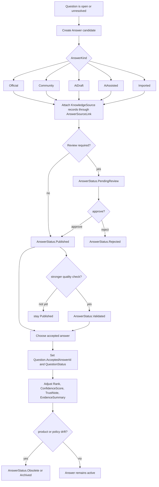

# Flow 03: Answer Production And Selection

This flow shows how answer candidates are created, evaluated, published, and eventually chosen as the accepted resolution.

## Visual flow

## Entities involved

| Entity | Role in the flow | Important members |
| --- | --- | --- |
| [Question](../Domain/Question.cs) | Hosts the answer candidates and points to the accepted answer. | `AcceptedAnswerId`, `Answers`, `Status`, `AnsweredAtUtc`, `ValidatedAtUtc`, `ResolvedAtUtc` |
| [Answer](../Domain/Answer.cs) | Represents each answer candidate or variant. | `Headline`, `Body`, `Kind`, `Status`, `Visibility`, `ContextKey`, `ApplicabilityRulesJson`, `ConfidenceScore`, `Rank`, `IsAccepted`, `IsCanonical`, `IsOfficial`, `PublishedAtUtc`, `ValidatedAtUtc`, `AcceptedAtUtc`, `RetiredAtUtc` |
| [KnowledgeSource](../Domain/KnowledgeSource.cs) | Stores the actual evidentiary artifact used to support the answer. | `Kind`, `Locator`, `IsAuthoritative`, `LastVerifiedAtUtc` |
| [AnswerSourceLink](../Domain/AnswerSourceLink.cs) | Connects the answer to evidence, citations, or canonical references. | `Role`, `Scope`, `Excerpt`, `ConfidenceScore`, `IsPrimary` |
| [ThreadActivity](../Domain/ThreadActivity.cs) | Records answer creation, approval, rejection, publication, acceptance, and validation. | `Kind`, `AnswerId`, `ActorKind`, `SnapshotJson`, `RevisionNumber` |

## Enums involved

| Enum | What it decides |
| --- | --- |
| [AnswerKind](../Domain/Enums/AnswerKind.cs) | Whether the candidate is official, community-provided, AI draft, AI-assisted, or imported. |
| [AnswerStatus](../Domain/Enums/AnswerStatus.cs) | Whether the candidate is draft, pending review, published, validated, rejected, obsolete, or archived. |
| [VisibilityScope](../Domain/Enums/VisibilityScope.cs) | Whether a published answer can be internal-only, authenticated, or public-facing. |
| [SourceRole](../Domain/Enums/SourceRole.cs) | Whether a source is evidence, citation, supporting context, or the canonical reference for the answer. |
| [ActivityKind](../Domain/Enums/ActivityKind.cs) | Typical events are `AnswerCreated`, `AnswerUpdated`, `AnswerPublished`, `AnswerAccepted`, `AnswerValidated`, and `AnswerRejected`. |
| [ActorKind](../Domain/Enums/ActorKind.cs) | Identifies whether the answer change came from a contributor, moderator, AI agent, system, or integration. |

## Interaction notes

- A single `Question` can hold many `Answer` rows at once. The domain does not assume a one-question-one-answer model.
- Acceptance and validation are related but different. A `Published` answer may be accepted operationally before it reaches `Validated`.
- `IsCanonical` lets the system keep a preferred answer variant even when multiple contextual answers coexist.
- `Rank` supports ordering and future voting strategies without needing a separate ranking entity.
