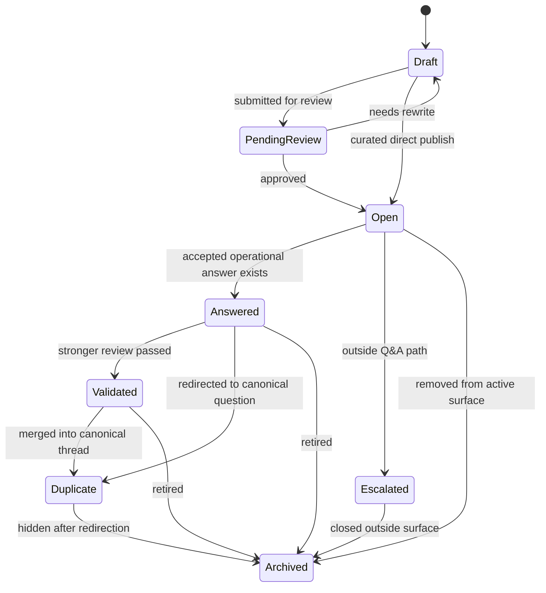
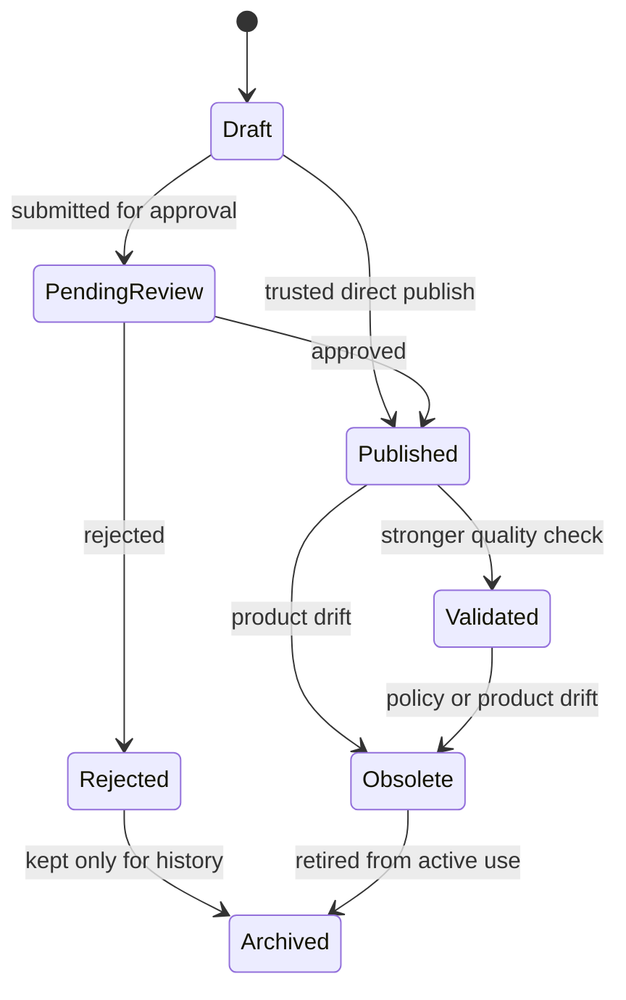

# Flow 04: Moderation, Validation, And Retirement

This flow visualizes the lifecycle of questions and answers under review and governance pressure.

## Question lifecycle

## Answer lifecycle

## Entities involved

| Entity | Role in the flow | Important members |
| --- | --- | --- |
| [QuestionSpace](../Domain/QuestionSpace.cs) | Defines whether review is needed before exposure. | `ModerationPolicy`, `RequiresQuestionReview`, `RequiresAnswerReview` |
| [Question](../Domain/Question.cs) | Carries thread-level workflow state. | `Status`, `AnsweredAtUtc`, `ValidatedAtUtc`, `ResolvedAtUtc`, `DuplicateOfQuestionId` |
| [Answer](../Domain/Answer.cs) | Carries answer-level workflow state. | `Status`, `PublishedAtUtc`, `ValidatedAtUtc`, `AcceptedAtUtc`, `RetiredAtUtc`, `IsAccepted` |
| [ThreadActivity](../Domain/ThreadActivity.cs) | Audits each workflow event. | `Kind`, `ActorKind`, `Notes`, `SnapshotJson`, `OccurredAtUtc` |

## Enums involved

| Enum | What it decides |
| --- | --- |
| [ModerationPolicy](../Domain/Enums/ModerationPolicy.cs) | Whether new content waits for review, becomes visible first, or depends on contributor trust. |
| [QuestionStatus](../Domain/Enums/QuestionStatus.cs) | Thread lifecycle from draft through review, answer, validation, escalation, duplicate, and archive. |
| [AnswerStatus](../Domain/Enums/AnswerStatus.cs) | Answer lifecycle from draft through publication, validation, rejection, obsolescence, and archive. |
| [ActivityKind](../Domain/Enums/ActivityKind.cs) | Stores the workflow transitions in the journal. |
| [ActorKind](../Domain/Enums/ActorKind.cs) | Stores who applied the moderation or validation decision. |

## Interaction notes

- `QuestionStatus` intentionally has no explicit rejected value. Question rejection is captured in `ThreadActivity` and the thread typically returns to `Draft` or exits the visible surface.
- `AnswerStatus.Rejected` exists because answer candidates are expected to compete more directly inside the same thread.
- `ModerationPolicy.TrustedContributors` is a branching rule, not a separate state. The trusted path usually bypasses `PendingReview`, while the untrusted path does not.
