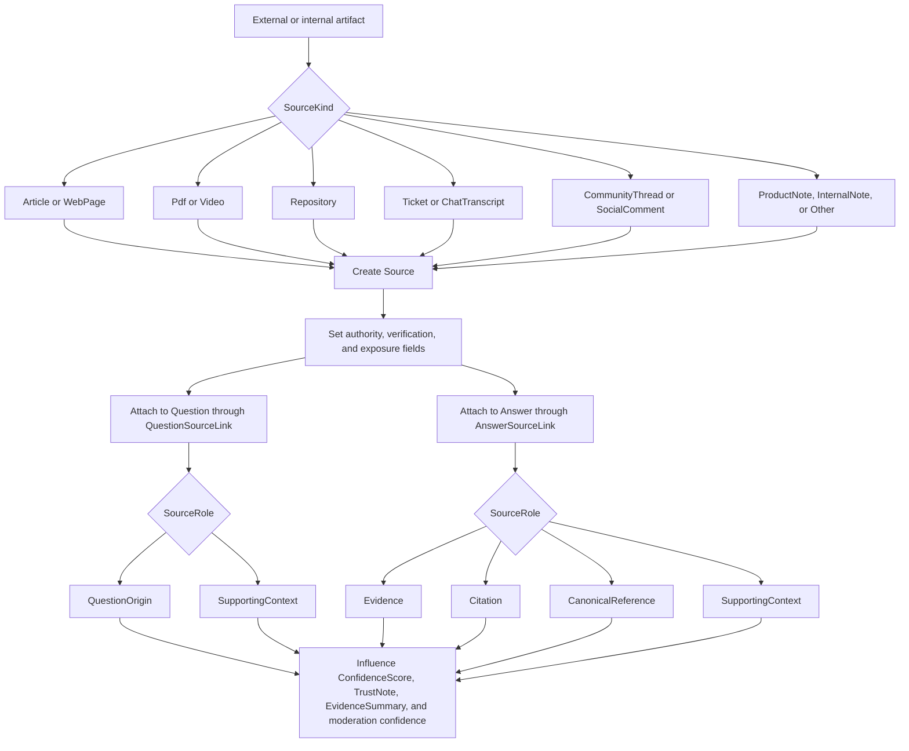

# Flow 05: Source Traceability And Trust

This flow documents how provenance and trust are represented from the first imported signal to the final public answer.

## Visual flow

## Entities involved

| Entity | Role in the flow | Important members |
| --- | --- | --- |
| [Source](../Domain/Source.cs) | Durable record of the source artifact. | `Kind`, `Locator`, `SystemName`, `ExternalId`, `Language`, `MediaType`, `MetadataJson`, `Visibility`, `AllowsPublicCitation`, `AllowsPublicExcerpt`, `IsAuthoritative`, `CapturedAtUtc`, `LastVerifiedAtUtc` |
| [QuestionSourceLink](../Domain/QuestionSourceLink.cs) | Explains why a source is attached to the thread. | `Role`, `Excerpt`, `Scope`, `ConfidenceScore`, `IsPrimary` |
| [AnswerSourceLink](../Domain/AnswerSourceLink.cs) | Explains why a source is attached to the answer. | `Role`, `Excerpt`, `Scope`, `ConfidenceScore`, `IsPrimary` |
| [Question](../Domain/Question.cs) | Receives confidence and provenance context. | `ConfidenceScore`, `OriginUrl`, `OriginReference`, `ThreadSummary` |
| [Answer](../Domain/Answer.cs) | Receives evidence summaries and trust messaging. | `ConfidenceScore`, `TrustNote`, `EvidenceSummary`, `IsOfficial` |

## Enums involved

| Enum | What it decides |
| --- | --- |
| [SourceKind](../Domain/Enums/SourceKind.cs) | What kind of artifact is being tracked. |
| [SourceRole](../Domain/Enums/SourceRole.cs) | Why the source is attached to the question or answer. |
| [QuestionKind](../Domain/Enums/QuestionKind.cs) | Helps interpret whether provenance started from curated, community, imported, or AI-suggested intake. |
| [AnswerKind](../Domain/Enums/AnswerKind.cs) | Helps interpret how much trust should exist before review. |

## Interaction notes

- Provenance is split in two layers on purpose: `Source` stores the artifact, while `QuestionSourceLink` and `AnswerSourceLink` store why that artifact matters to a specific thread or answer.
- `IsAuthoritative` and `LastVerifiedAtUtc` live on `Source` because trust in the artifact should be reusable across multiple threads.
- Public citations and excerpts now require explicit source-level exposure settings, not just a link role.
- `ConfidenceScore` lives on `Question`, `Answer`, and the link entities, which allows trust to be both global and context-specific.
