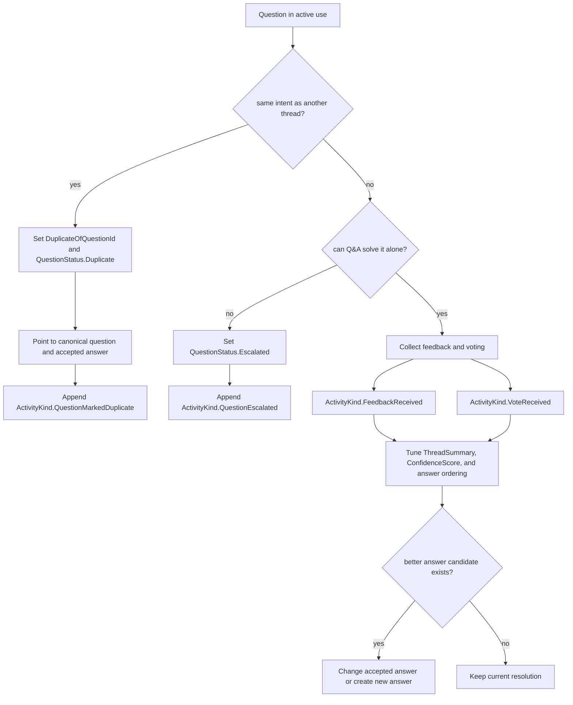

# Flow 06: Duplicate, Escalation, And Feedback

This flow covers runtime cases where a thread should be redirected, escalated, or improved from user signals after publication.

## Visual flow

## Entities involved

| Entity | Role in the flow | Important members |
| --- | --- | --- |
| [Question](../Domain/Question.cs) | Carries duplicate and escalation semantics. | `Status`, `DuplicateOfQuestionId`, `AcceptedAnswerId`, `ConfidenceScore`, `ThreadSummary` |
| [Answer](../Domain/Answer.cs) | Receives votes and can be replaced as the accepted answer. | `Rank`, `IsAccepted`, `AcceptedAtUtc`, `ConfidenceScore` |
| [Activity](../Domain/Activity.cs) | Stores duplicate, escalation, feedback, and vote events. | `Kind`, `ActorKind`, `MetadataJson`, `Notes`, `OccurredAtUtc` |

## Enums involved

| Enum | What it decides |
| --- | --- |
| [QuestionStatus](../Domain/Enums/QuestionStatus.cs) | Whether the thread stays active, becomes duplicate, escalated, or archived. |
| [ActivityKind](../Domain/Enums/ActivityKind.cs) | Typical events are `QuestionMarkedDuplicate`, `QuestionEscalated`, `FeedbackReceived`, and `VoteReceived`. |
| [ActorKind](../Domain/Enums/ActorKind.cs) | Records whether the signal came from customer, contributor, moderator, system, AI, or integration. |
| [ChannelKind](../Domain/Enums/ChannelKind.cs) | Helps interpret where the original question or later signals came from, even when the feedback payload is stored in activity metadata. |

## Interaction notes

- `DuplicateOfQuestionId` keeps knowledge consolidated by redirecting similar questions to one canonical thread instead of cloning answers.
- `QuestionStatus.Escalated` is the branch for cases that require action outside the Q&A model, such as incidents, compliance review, or account-specific operations.
- `Activity.MetadataJson` is the extensibility slot for vote payloads, feedback reason codes, or external escalation references.
