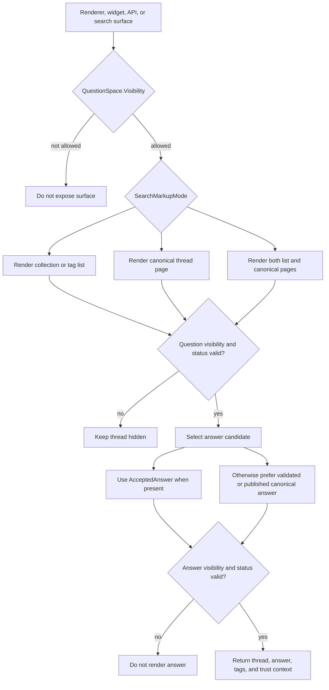

# Flow 07: Discovery And Consumption

This flow shows how different surfaces consume the same Q&A domain while respecting visibility, search posture, and answer quality.

## Visual flow

## Entities involved

| Entity | Role in the flow | Important members |
| --- | --- | --- |
| [QuestionSpace](../Domain/QuestionSpace.cs) | Defines whether the surface is visible and how it behaves for search and rendering. | `Visibility`, `SearchMarkupMode`, `Kind`, `PublishedAtUtc` |
| [Question](../Domain/Question.cs) | Provides the canonical thread metadata to be rendered. | `Status`, `Visibility`, `Summary`, `ThreadSummary`, `Tags`, `AcceptedAnswerId` |
| [Answer](../Domain/Answer.cs) | Supplies the chosen response payload. | `Status`, `Visibility`, `Headline`, `Body`, `TrustNote`, `EvidenceSummary`, `IsCanonical`, `IsOfficial` |
| [Tag](../Domain/Tag.cs) | Supports landing pages, filters, and navigation. | `Name` |

## Enums involved

| Enum | What it decides |
| --- | --- |
| [VisibilityScope](../Domain/Enums/VisibilityScope.cs) | Whether the content is internal-only, authenticated, public, or public-indexed. |
| [SearchMarkupMode](../Domain/Enums/SearchMarkupMode.cs) | Whether the renderer should behave like a list, a canonical question page, a hybrid, or keep markup off. |
| [QuestionStatus](../Domain/Enums/QuestionStatus.cs) | Whether the thread is fit for active use or should remain hidden, redirected, or archived. |
| [AnswerStatus](../Domain/Enums/AnswerStatus.cs) | Whether the answer is published, validated, obsolete, or archived. |
| [SpaceKind](../Domain/Enums/SpaceKind.cs) | Helps the consuming surface decide whether to emphasize editorial order, community contribution, or both. |

## Interaction notes

- Discovery starts at `QuestionSpace`, not at `Question`. The space defines whether the renderer should expose lists, canonical pages, or both.
- `AcceptedAnswerId` is the fastest path for consumption. When it is empty, consumers must apply fallback selection logic over `Answer.Status`, `IsCanonical`, and `Visibility`.
- The implementation now defaults spaces, questions, and answers to `Internal`, so public discovery only happens after an explicit promotion step.
- `Tag` supports discovery and navigation, but it does not replace the primary grouping role of `QuestionSpace`.
