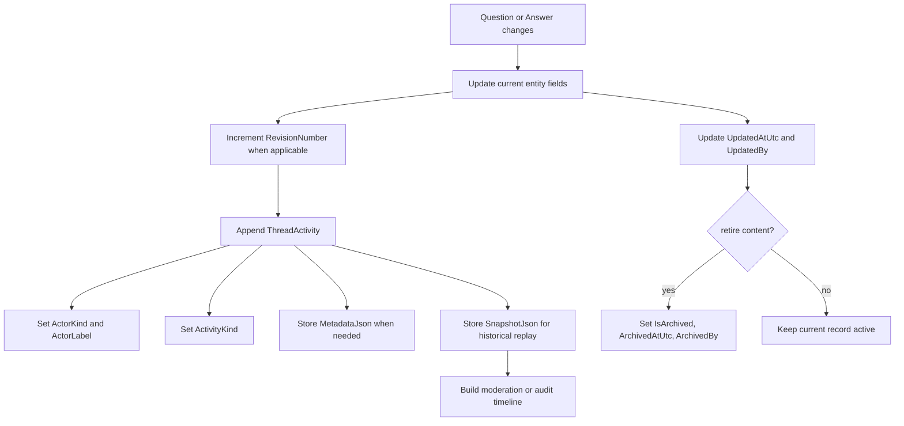

# Flow 08: Audit And Evolution

This flow shows how the sample model preserves operational history without introducing many specialized history entities.

## Visual flow

## Entities involved

| Entity | Role in the flow | Important members |
| --- | --- | --- |
| [DomainEntity](../Domain/DomainEntity.cs) | Shared audit shell for the model. | `TenantId`, `CreatedAtUtc`, `CreatedBy`, `UpdatedAtUtc`, `UpdatedBy`, `ArchivedAtUtc`, `ArchivedBy`, `IsArchived` |
| [Question](../Domain/Question.cs) | Carries the current thread revision pointer. | `RevisionNumber`, `LastActivityAtUtc`, `Status` |
| [Answer](../Domain/Answer.cs) | Carries the current answer revision pointer. | `RevisionNumber`, `Status`, `RetiredAtUtc` |
| [ThreadActivity](../Domain/ThreadActivity.cs) | Append-only journal used for audit and replay. | `Kind`, `ActorKind`, `Notes`, `MetadataJson`, `SnapshotJson`, `RevisionNumber`, `OccurredAtUtc` |

## Enums involved

| Enum | What it decides |
| --- | --- |
| [ActivityKind](../Domain/Enums/ActivityKind.cs) | Which business event was captured in the journal. |
| [ActorKind](../Domain/Enums/ActorKind.cs) | Who or what performed the change. |
| [QuestionStatus](../Domain/Enums/QuestionStatus.cs) | Helps interpret the thread state when a snapshot is recorded. |
| [AnswerStatus](../Domain/Enums/AnswerStatus.cs) | Helps interpret the answer state when a snapshot is recorded. |

## Interaction notes

- The sample deliberately uses `ThreadActivity` instead of separate revision, moderation-history, and feedback-history entities.
- `RevisionNumber` on `Question` and `Answer` is the current pointer. The historical detail belongs in `ThreadActivity.SnapshotJson`.
- `DomainEntity` provides cross-cutting audit fields, while `ThreadActivity` provides event-level narrative.
