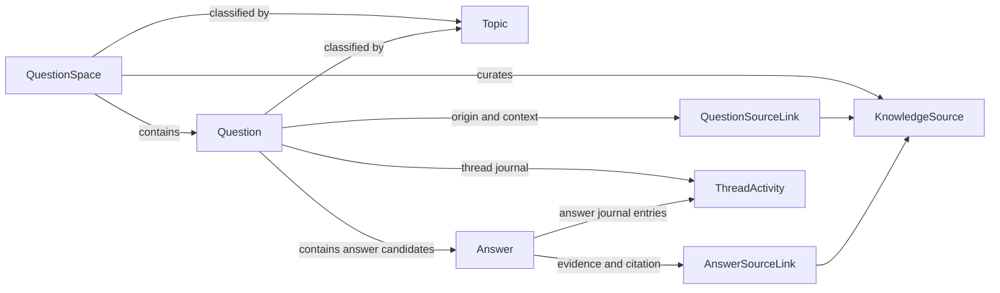

# NewQaModel Flow Catalog

This folder documents the supported operating flows for `BaseFaq.Sample.Features.NewQaModel`.

It is not a list of every theoretical property permutation. It is the set of core flows that the sample domain can express today. Real implementations are composed by combining these flows with the enum choices already present in the model.

For a full reference of every class and every enum in the sample model, use [../domain-model-reference.md](../domain-model-reference.md).

When this model is migrated into the main solution, the preferred production implementation is still to keep `BaseEntity`, `AuditableEntity`, `IMustHaveTenant`, and `BaseDbContext`, then apply the Q&A-specific safety rules on top of that existing infrastructure.

## Structural map

## Flow catalog

| Flow | Purpose | Main entities | Main enums |
| --- | --- | --- | --- |
| [01-space-setup-and-governance.md](01-space-setup-and-governance.md) | Defines the operating surface and governance defaults. | `QuestionSpace`, `Topic`, `KnowledgeSource` | `SpaceKind`, `VisibilityScope`, `ModerationPolicy`, `SearchMarkupMode` |
| [02-question-intake-and-routing.md](02-question-intake-and-routing.md) | Explains how questions enter, are classified, and move into workflow. | `QuestionSpace`, `Question`, `QuestionSourceLink`, `KnowledgeSource`, `Topic`, `ThreadActivity` | `QuestionKind`, `QuestionStatus`, `ChannelKind`, `ModerationPolicy`, `SourceRole`, `ActorKind`, `ActivityKind` |
| [03-answer-production-and-selection.md](03-answer-production-and-selection.md) | Shows how answers are created, reviewed, ranked, accepted, and retired. | `Question`, `Answer`, `AnswerSourceLink`, `KnowledgeSource`, `ThreadActivity` | `AnswerKind`, `AnswerStatus`, `VisibilityScope`, `SourceRole`, `ActorKind`, `ActivityKind` |
| [04-moderation-validation-and-retirement.md](04-moderation-validation-and-retirement.md) | Visualizes the lifecycle state transitions for questions and answers. | `QuestionSpace`, `Question`, `Answer`, `ThreadActivity` | `ModerationPolicy`, `QuestionStatus`, `AnswerStatus`, `ActivityKind`, `ActorKind` |
| [05-source-traceability-and-trust.md](05-source-traceability-and-trust.md) | Documents provenance, evidence, citation, and confidence behavior. | `KnowledgeSource`, `QuestionSourceLink`, `AnswerSourceLink`, `Question`, `Answer` | `SourceKind`, `SourceRole`, `QuestionKind`, `AnswerKind` |
| [06-duplicate-escalation-feedback.md](06-duplicate-escalation-feedback.md) | Covers redirection to canonical threads, escalations, and post-use signals. | `Question`, `Answer`, `ThreadActivity` | `QuestionStatus`, `ActivityKind`, `ActorKind`, `ChannelKind` |
| [07-discovery-and-consumption.md](07-discovery-and-consumption.md) | Explains how internal, authenticated, and public surfaces consume the model. | `QuestionSpace`, `Question`, `Answer`, `Topic` | `VisibilityScope`, `SearchMarkupMode`, `QuestionStatus`, `AnswerStatus`, `SpaceKind` |
| [08-audit-and-evolution.md](08-audit-and-evolution.md) | Shows how revision, snapshots, and archival behave over time. | `DomainEntity`, `Question`, `Answer`, `ThreadActivity` | `ActivityKind`, `ActorKind`, `QuestionStatus`, `AnswerStatus` |

## Variation axes

Every concrete rollout is defined by a combination of these axes:

| Axis | Controlled by |
| --- | --- |
| Space operating model | `SpaceKind`, `ModerationPolicy`, `VisibilityScope`, `SearchMarkupMode` |
| Question intake shape | `QuestionKind`, `ChannelKind`, `QuestionStatus` |
| Answer production shape | `AnswerKind`, `AnswerStatus`, `VisibilityScope` |
| Provenance model | `SourceKind`, `SourceRole` |
| Audit ownership | `ActivityKind`, `ActorKind` |

## Recommended reading order

1. Read [01-space-setup-and-governance.md](01-space-setup-and-governance.md) first.
2. Continue with [02-question-intake-and-routing.md](02-question-intake-and-routing.md) and [03-answer-production-and-selection.md](03-answer-production-and-selection.md).
3. Use [04-moderation-validation-and-retirement.md](04-moderation-validation-and-retirement.md) and [05-source-traceability-and-trust.md](05-source-traceability-and-trust.md) as the governance layer.
4. Use [06-duplicate-escalation-feedback.md](06-duplicate-escalation-feedback.md), [07-discovery-and-consumption.md](07-discovery-and-consumption.md), and [08-audit-and-evolution.md](08-audit-and-evolution.md) for runtime behavior and long-term maintenance.
