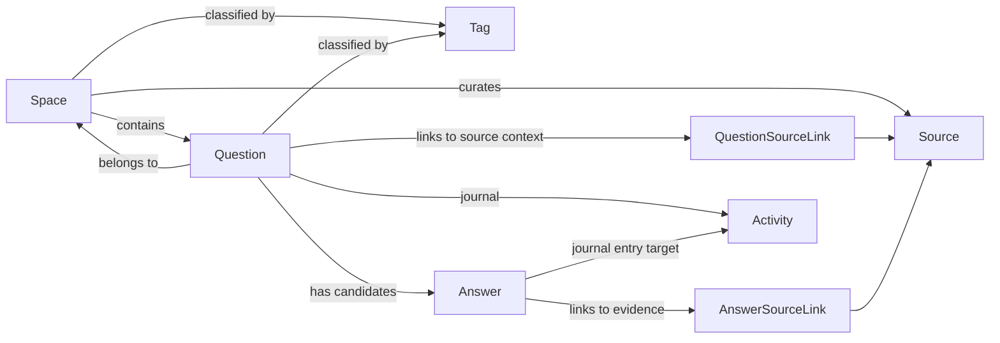

# NewQaModel Domain Model Reference

This document is the single reference for the domain model in `BaseFaq.Sample.Features.NewQaModel`.

It explains every class and every enum that exists in the sample today, without mixing in legacy FAQ terminology.

## Scope

This reference covers:

- all domain classes in `Domain/`
- all enums in `Domain/Enums/`
- the role of each type in the Q&A model
- the most important relationships and behavior decisions

It does not repeat every line of code. The source files remain the implementation authority.

## Production persistence guidance

This sample uses its own `DomainEntity` so the Q&A model can be explained in isolation.

That is not the recommended migration shape for the repository.

When the model moves into the main solution:

- keep `BaseEntity` as the identifier root
- keep `AuditableEntity` for audit and soft-delete integration
- keep `IMustHaveTenant` so the existing `BaseDbContext` tenant filters and indexes still apply
- treat `DomainEntity` as the conceptual responsibility to preserve, not as a mandatory replacement of those shared abstractions

Recommended split of responsibilities:

| Concern | Keep from current solution | Add or preserve for the Q&A migration |
| --- | --- | --- |
| Tenant isolation | `IMustHaveTenant`, `BaseDbContext` tenant query filters, tenant indexes | Reject cross-tenant relationships on the write side before `SaveChanges` |
| Audit and soft delete | `AuditableEntity`, `BaseDbContext` audit stamping, soft-delete filters | Keep `Activity` append-only by workflow policy and persistence rules |
| Public exposure | Existing auth and endpoint boundaries | Add fail-closed publish, validate, accept, and cite rules for Q&A lifecycle transitions |
| Provenance | Existing persistence and DTO validation patterns | Add explicit source visibility, citation, and excerpt controls |
| Flexible metadata | Existing command/DTO validation approach | Validate JSON, URLs, and other free-form payloads before persistence |

## Type inventory

### Classes

| Type | File | Role |
| --- | --- | --- |
| `DomainEntity` | [Domain/DomainEntity.cs](./Domain/DomainEntity.cs) | Conceptual shared audit and tenancy base class for the sample. In production, these responsibilities should usually map onto `BaseEntity` + `AuditableEntity` + `IMustHaveTenant`. |
| `Space` | [Domain/Space.cs](./Domain/Space.cs) | Top-level container that groups questions and defines governance defaults. |
| `Question` | [Domain/Question.cs](./Domain/Question.cs) | Main thread aggregate for a single user-facing question. |
| `Answer` | [Domain/Answer.cs](./Domain/Answer.cs) | Candidate or canonical response attached to a question. |
| `Source` | [Domain/Source.cs](./Domain/Source.cs) | Reference record for evidence, origin, and trust inputs. |
| `Tag` | [Domain/Tag.cs](./Domain/Tag.cs) | Lightweight taxonomy that classifies spaces and questions. |
| `QuestionSourceLink` | [Domain/QuestionSourceLink.cs](./Domain/QuestionSourceLink.cs) | Context-specific link from a question to a source. |
| `AnswerSourceLink` | [Domain/AnswerSourceLink.cs](./Domain/AnswerSourceLink.cs) | Context-specific link from an answer to a source. |
| `Activity` | [Domain/Activity.cs](./Domain/Activity.cs) | Append-only journal for workflow, moderation, trust, and audit events. |

### Enums

| Type | File | Role |
| --- | --- | --- |
| `SpaceKind` | [Domain/Enums/SpaceKind.cs](./Domain/Enums/SpaceKind.cs) | Defines the operating model of a space. |
| `VisibilityScope` | [Domain/Enums/VisibilityScope.cs](./Domain/Enums/VisibilityScope.cs) | Defines who can see a space, question, or answer. |
| `ModerationPolicy` | [Domain/Enums/ModerationPolicy.cs](./Domain/Enums/ModerationPolicy.cs) | Defines how review gates behave. |
| `SearchMarkupMode` | [Domain/Enums/SearchMarkupMode.cs](./Domain/Enums/SearchMarkupMode.cs) | Defines how the space behaves for search-facing rendering. |
| `QuestionKind` | [Domain/Enums/QuestionKind.cs](./Domain/Enums/QuestionKind.cs) | Explains how a question entered the domain. |
| `QuestionStatus` | [Domain/Enums/QuestionStatus.cs](./Domain/Enums/QuestionStatus.cs) | Defines the lifecycle of a question thread. |
| `AnswerKind` | [Domain/Enums/AnswerKind.cs](./Domain/Enums/AnswerKind.cs) | Explains where an answer came from. |
| `AnswerStatus` | [Domain/Enums/AnswerStatus.cs](./Domain/Enums/AnswerStatus.cs) | Defines the lifecycle of an answer candidate. |
| `ChannelKind` | [Domain/Enums/ChannelKind.cs](./Domain/Enums/ChannelKind.cs) | Describes the entry channel for questions or signals. |
| `SourceKind` | [Domain/Enums/SourceKind.cs](./Domain/Enums/SourceKind.cs) | Classifies the type of source material. |
| `SourceRole` | [Domain/Enums/SourceRole.cs](./Domain/Enums/SourceRole.cs) | Explains why a source is attached to a question or answer. |
| `ActivityKind` | [Domain/Enums/ActivityKind.cs](./Domain/Enums/ActivityKind.cs) | Describes workflow events in the thread journal. |
| `ActorKind` | [Domain/Enums/ActorKind.cs](./Domain/Enums/ActorKind.cs) | Identifies who or what caused an activity event. |

## Structural view

## Class reference

### `DomainEntity`

Source: [Domain/DomainEntity.cs](./Domain/DomainEntity.cs)

Business role:

- provides the minimum persistence shell shared by all domain types
- keeps the model tenant-aware
- provides soft-archive support without forcing physical deletion

Key fields:

| Field | Meaning |
| --- | --- |
| `Id` | Unique identifier of the record. |
| `TenantId` | Tenant boundary for multitenant ownership. |
| `CreatedAtUtc`, `CreatedBy` | Creation audit fields. |
| `UpdatedAtUtc`, `UpdatedBy` | Last update audit fields. |
| `ArchivedAtUtc`, `ArchivedBy`, `IsArchived` | Soft retirement fields. |

Design note:

- this class is intentionally small because lifecycle detail for question threads lives in `Activity`, not in the base entity
- during migration, this responsibility should usually be represented by the repository-standard `BaseEntity`, `AuditableEntity`, and `IMustHaveTenant` instead of a second parallel base type

### `Space`

Source: [Domain/Space.cs](./Domain/Space.cs)

Business role:

- groups a coherent surface of questions and answers
- defines whether the surface is curated, community-driven, or hybrid
- establishes moderation and visibility defaults
- provides scope boundaries such as product and journey

Core fields:

| Field | Meaning |
| --- | --- |
| `Name` | Human-readable display name of the surface. |
| `Key` | Stable routing key for APIs, pages, and embeds. |
| `Summary` | Description of what belongs in the space. |
| `DefaultLanguage` | Default locale used for curation and rendering. |
| `Kind` | Operating model of the space. |
| `Visibility` | Audience exposure of the space. The implementation now defaults this to `Internal`. |
| `ModerationPolicy` | Review model for new submissions. |
| `SearchMarkupMode` | Search-facing rendering posture. |
| `ProductScope`, `JourneyScope` | Optional business boundaries. |
| `AcceptsQuestions`, `AcceptsAnswers` | Whether the space accepts new submissions. |
| `RequiresQuestionReview`, `RequiresAnswerReview` | Per-content review gates. |
| `PublishedAtUtc`, `LastValidatedAtUtc` | Governance timestamps. |

Relationships:

- `Questions`: the primary set of threads inside the space
- `Tags`: classification labels used across the space
- `CuratedSources`: reusable sources curated at space level

Design note:

- `Space` is the primary grouping unit of the model; `Tag` classifies, but does not replace it
- production implementation should keep space exposure fail-closed even if the persistence entity continues to use repository-standard base types and public setters

### `Question`

Source: [Domain/Question.cs](./Domain/Question.cs)

Business role:

- represents one question thread
- stores intake, routing, lifecycle, and contextual segmentation data
- points to the accepted answer when a thread is resolved
- supports duplicate redirection and operational audit

Core fields:

| Field | Meaning |
| --- | --- |
| `Title` | Main user-facing question text. |
| `Key` | Stable thread key for pages and APIs. |
| `Summary` | Short card or search summary. |
| `ContextNote` | Extra intake or moderator context. |
| `Kind` | How the question entered the model. |
| `Status` | Current lifecycle state of the thread. |
| `Visibility` | Audience exposure of the thread. The implementation defaults this to `Internal` and rejects public exposure for pre-review states. |
| `OriginChannel` | Channel that created the thread. |
| `Language` | Source language captured at intake. |
| `ProductScope`, `JourneyScope`, `AudienceScope` | Business segmentation. |
| `ContextKey` | Machine-friendly selector for variants such as plan, country, or version. |
| `OriginUrl`, `OriginReference` | Raw origin hooks. |
| `ThreadSummary` | Operational summary of what the thread resolved. |
| `ConfidenceScore` | Current trust level for serving this thread safely. |
| `RevisionNumber` | Current revision pointer for the thread. |

Relationships:

| Relationship | Meaning |
| --- | --- |
| `SpaceId` and `Space` | Each question belongs to one `Space`. |
| `AcceptedAnswerId` and `AcceptedAnswer` | Points to the chosen resolution when one exists. |
| `DuplicateOfQuestionId` and `DuplicateOfQuestion` | Redirects this question to a canonical thread. |
| `DuplicateQuestions` | Reverse navigation from a canonical question to its duplicates. |
| `Answers` | Candidate and final answers for the thread. |
| `Sources` | Question-specific origin and context links. |
| `Tags` | Tags and taxonomy labels applied to the thread. |
| `Activity` | Append-only journal of thread events. |

Important timestamps:

- `AnsweredAtUtc`: a usable answer exists
- `ResolvedAtUtc`: the thread is operationally resolved
- `ValidatedAtUtc`: the thread passed stronger governance
- `LastActivityAtUtc`: last observed thread event

Design note:

- `Question` is the main operational aggregate of the model
- accepted answers, source links, duplicate links, and activity entries must be tenant-checked before attachment, even though read-side tenant filtering already exists in `BaseDbContext`

### `Answer`

Source: [Domain/Answer.cs](./Domain/Answer.cs)

Business role:

- stores an answer candidate or answer variant
- supports official, community, and imported response models
- separates answer origin from answer lifecycle
- allows accepted, canonical, official, validated, and retired states to coexist cleanly

Core fields:

| Field | Meaning |
| --- | --- |
| `Headline` | Short answer summary for previews and ranking. |
| `Body` | Full response body. |
| `Kind` | Origin model of the answer. |
| `Status` | Current lifecycle state of the answer. |
| `Visibility` | Audience exposure of the answer. The implementation defaults this to `Internal` and only allows public exposure from published or validated states. |
| `Language` | Language of the answer variant. |
| `ContextKey` | Variant selector for country, plan, version, or integration. |
| `ApplicabilityRulesJson` | Serialized matching rules for contextual fit. |
| `TrustNote` | Human-readable explanation of why the answer can be trusted. |
| `EvidenceSummary` | Cached moderation and public trust summary. |
| `AuthorLabel` | Display origin label such as Support, Engineering, or Operations. |
| `ConfidenceScore` | Trust level for the answer itself. |
| `Rank` | Ordering signal among answer candidates. |
| `RevisionNumber` | Current revision pointer of the answer. |
| `IsAccepted` | Whether the answer is the chosen resolution of the thread. |
| `IsCanonical` | Whether the answer is the preferred answer variant. It now starts false until explicitly promoted. |
| `IsOfficial` | Whether the answer is owned by the official operation. It now starts false until explicitly promoted. |

Relationships:

| Relationship | Meaning |
| --- | --- |
| `QuestionId` and `Question` | Each answer belongs to one question thread. |
| `Sources` | Evidence and citation links for the answer. |
| `Activity` | Journal entries that target this answer. |

Important timestamps:

- `PublishedAtUtc`: answer became available for use
- `ValidatedAtUtc`: answer passed stronger governance
- `AcceptedAtUtc`: answer became the chosen thread resolution
- `RetiredAtUtc`: answer left active use

Design note:

- the model allows many answers per question because a serious Q&A platform cannot assume one static response forever
- public exposure must stay fail-closed for answers, especially unreviewed candidates, regardless of whether the final EF entity keeps public setters

### `Source`

Source: [Domain/Source.cs](./Domain/Source.cs)

Business role:

- represents the durable source artifact behind provenance, evidence, and citations
- stores enough metadata for future connectors without requiring schema redesign
- allows source trust to be reused across multiple questions and answers

Core fields:

| Field | Meaning |
| --- | --- |
| `Kind` | Type of artifact being stored. |
| `Locator` | Stable pointer to the upstream artifact. |
| `Label` | Friendly label for display or moderation. |
| `Scope` | Optional source sub-scope such as section, transcript window, or ticket area. |
| `SystemName` | Upstream provider such as GitHub, Slack, or Zendesk. |
| `ExternalId` | Upstream identifier in the provider system. |
| `Language` | Language of the source. |
| `MediaType` | MIME-like media classification if needed. |
| `Checksum` | Stable content fingerprint when available. |
| `MetadataJson` | Extensibility payload for source-specific metadata. |
| `Visibility` | Source-level exposure boundary used to prevent internal artifacts from leaking into public trust surfaces. |
| `AllowsPublicCitation` | Whether the source may be cited directly on public surfaces. |
| `AllowsPublicExcerpt` | Whether excerpt text may be shown publicly. |
| `IsAuthoritative` | Strong trust signal for canonical sources. |
| `CapturedAtUtc` | When the source was observed or imported. |
| `LastVerifiedAtUtc` | When the source was last revalidated. |

Relationships:

- `Spaces`: curated source pool attached to spaces
- `Questions`: question-specific source links
- `Answers`: answer-specific source links

Design note:

- `Source` stores the artifact itself; link entities store why the artifact matters in a specific context
- public citation now requires explicit source verification and explicit public citation or excerpt permission
- in production, that policy can live in handlers, validators, or domain services; it does not require abandoning the current EF base abstractions

### `Tag`

Source: [Domain/Tag.cs](./Domain/Tag.cs)

Business role:

- provides lightweight taxonomy
- classifies both spaces and questions
- supports filtering, navigation, routing, and reusable business labels

Core fields:

| Field | Meaning |
| --- | --- |
| `Name` | Normalized tag label such as `billing` or `api`. |

Relationships:

- `Spaces`: spaces classified by this tag
- `Questions`: questions classified by this tag

Design note:

- `Tag` is intentionally lightweight and not modeled as a heavy ontology

### `QuestionSourceLink`

Source: [Domain/QuestionSourceLink.cs](./Domain/QuestionSourceLink.cs)

Business role:

- explains why a `Source` is attached to a specific question
- stores question-level provenance and context
- distinguishes question origin from supporting context

Core fields:

| Field | Meaning |
| --- | --- |
| `QuestionId`, `Question` | Question that receives the source link. |
| `SourceId`, `Source` | Source artifact referenced by the question. |
| `Role` | Why the source is attached to the question. |
| `Label` | Friendly label for moderators or renderers. |
| `Scope` | Question-specific scope inside the source. |
| `Excerpt` | Extracted text or snippet relevant to the thread. |
| `Order` | Ordering hint among multiple links. |
| `ConfidenceScore` | Context-specific trust signal for this link. |
| `IsPrimary` | Whether this is the main link for the question. |

Design note:

- a source may be globally trustworthy, but its importance to a specific question is modeled here
- public question exposure now re-checks whether excerpts from the linked source are actually safe to show

### `AnswerSourceLink`

Source: [Domain/AnswerSourceLink.cs](./Domain/AnswerSourceLink.cs)

Business role:

- explains why a `Source` is attached to a specific answer
- carries answer-level evidence, citations, and canonical references
- supports explicit trust modeling for public or moderated answers

Core fields:

| Field | Meaning |
| --- | --- |
| `AnswerId`, `Answer` | Answer that receives the source link. |
| `SourceId`, `Source` | Source artifact referenced by the answer. |
| `Role` | Why the source is attached to the answer. |
| `Label` | Friendly label for moderators or renderers. |
| `Scope` | Answer-specific scope inside the source. |
| `Excerpt` | Relevant evidence snippet. |
| `Order` | Ordering hint among multiple evidence links. |
| `ConfidenceScore` | Context-specific trust signal for this evidence link. |
| `IsPrimary` | Whether this is the primary evidence link. |

Design note:

- separating `QuestionSourceLink` from `AnswerSourceLink` keeps origin and evidence concerns distinct
- public citations and excerpts are now blocked unless the reusable source explicitly allows them

### `Activity`

Source: [Domain/Activity.cs](./Domain/Activity.cs)

Business role:

- records the operational history of the thread
- centralizes moderation, publication, acceptance, feedback, and voting events
- preserves optional snapshots without requiring many dedicated history tables

Core fields:

| Field | Meaning |
| --- | --- |
| `QuestionId`, `Question` | Thread that owns the activity. |
| `AnswerId`, `Answer` | Optional answer targeted by the activity. |
| `Kind` | Business event that occurred. |
| `ActorKind` | Who or what caused the event. |
| `ActorLabel` | Friendly actor label for timelines and moderation screens. |
| `Notes` | Human-readable explanation of the event. |
| `MetadataJson` | Flexible payload for system details, moderation labels, vote payloads, or connector ids. |
| `SnapshotJson` | Optional serialized state used for audit or replay. |
| `RevisionNumber` | Optional revision pointer associated with the event. |
| `OccurredAtUtc` | Timestamp of the event. |

Design note:

- this is the main simplification mechanism of the sample: one journal instead of many separate revision and moderation entities
- the production migration should preserve append-only behavior even if the persistence entity still inherits from `AuditableEntity`; operationally, updates and deletes should not be part of the normal workflow for this journal

## Enum reference

### `SpaceKind`

Source: [Domain/Enums/SpaceKind.cs](./Domain/Enums/SpaceKind.cs)

| Value | Meaning |
| --- | --- |
| `CuratedKnowledge` | Editorial or operational teams mostly own the space. |
| `Community` | Community participation is the primary operating assumption. |
| `Hybrid` | Official content and community participation coexist in the same space. |

### `VisibilityScope`

Source: [Domain/Enums/VisibilityScope.cs](./Domain/Enums/VisibilityScope.cs)

| Value | Meaning |
| --- | --- |
| `Internal` | Visible only to internal operations. |
| `Authenticated` | Visible only to signed-in users. |
| `Public` | Publicly visible, but not necessarily intended for indexing. |
| `PublicIndexed` | Publicly visible and suitable for canonical indexing. |

### `ModerationPolicy`

Source: [Domain/Enums/ModerationPolicy.cs](./Domain/Enums/ModerationPolicy.cs)

| Value | Meaning |
| --- | --- |
| `None` | No explicit moderation gate. |
| `PreModeration` | Content must be reviewed before becoming visible. |
| `PostModeration` | Content becomes visible first and is reviewed afterward. |
| `TrustedContributors` | Trusted contributors bypass part of the review path while others still require moderation. |

### `SearchMarkupMode`

Source: [Domain/Enums/SearchMarkupMode.cs](./Domain/Enums/SearchMarkupMode.cs)

| Value | Meaning |
| --- | --- |
| `CuratedList` | Surface behaves like a collection or editorial list. |
| `QuestionPage` | Surface behaves like a canonical single-question page. |
| `Hybrid` | Both collection and single-question behaviors are valid. |
| `Off` | Search-facing markup is intentionally disabled. |

### `QuestionKind`

Source: [Domain/Enums/QuestionKind.cs](./Domain/Enums/QuestionKind.cs)

| Value | Meaning |
| --- | --- |
| `Curated` | Intentionally authored by internal teams. |
| `Community` | Created by community participation. |
| `Imported` | Brought from another system. |

### `QuestionStatus`

Source: [Domain/Enums/QuestionStatus.cs](./Domain/Enums/QuestionStatus.cs)

| Value | Meaning |
| --- | --- |
| `Draft` | Exists but is not ready for operational or public use. |
| `PendingReview` | Waiting for moderation or editorial approval. |
| `Open` | Live and actively unresolved or still under discussion. |
| `Answered` | Has an operationally useful answer. |
| `Validated` | Has a reviewed and strongly trusted resolution. |
| `Escalated` | Requires handling outside the normal Q&A path. |
| `Duplicate` | Redirects to another canonical thread. |
| `Archived` | No longer active in the knowledge surface. |

### `AnswerKind`

Source: [Domain/Enums/AnswerKind.cs](./Domain/Enums/AnswerKind.cs)

| Value | Meaning |
| --- | --- |
| `Official` | Official answer owned by the product or support operation. |
| `Community` | Answer provided by a community participant. |
| `Imported` | Answer imported from another system or knowledge base. |

### `AnswerStatus`

Source: [Domain/Enums/AnswerStatus.cs](./Domain/Enums/AnswerStatus.cs)

| Value | Meaning |
| --- | --- |
| `Draft` | Still being prepared. |
| `PendingReview` | Waiting for moderation or editorial review. |
| `Published` | Visible and usable. |
| `Validated` | Passed a stronger quality or governance check. |
| `Rejected` | Reviewed and not accepted for use. |
| `Obsolete` | No longer current because of product or policy drift. |
| `Archived` | Retired from active operations but preserved historically. |

### `ChannelKind`

Source: [Domain/Enums/ChannelKind.cs](./Domain/Enums/ChannelKind.cs)

| Value | Meaning |
| --- | --- |
| `Manual` | Created directly by an operator or internal user. |
| `Widget` | Captured from an embed or widget. |
| `Api` | Submitted by API. |
| `HelpCenter` | Imported from a help center surface. |
| `Ticket` | Imported or derived from a support ticket flow. |
| `Community` | Originated from a community forum or discussion area. |
| `Social` | Originated from a social platform. |
| `Chat` | Originated from a chat conversation. |
| `Import` | Arrived through bulk import or sync. |
| `Other` | Fallback for uncommon channels. |

### `SourceKind`

Source: [Domain/Enums/SourceKind.cs](./Domain/Enums/SourceKind.cs)

| Value | Meaning |
| --- | --- |
| `Article` | Curated article or knowledge document. |
| `WebPage` | Standard web page. |
| `Pdf` | PDF document. |
| `Video` | Video source. |
| `Repository` | Repository or code-hosting artifact. |
| `Ticket` | Support ticket or resolved case. |
| `CommunityThread` | Community discussion thread. |
| `SocialComment` | Social comment or reply chain. |
| `ChatTranscript` | Chat or messaging transcript. |
| `ProductNote` | Release note, change log, or product note. |
| `InternalNote` | Internal-only operational note. |
| `Other` | Fallback for uncommon source types. |

### `SourceRole`

Source: [Domain/Enums/SourceRole.cs](./Domain/Enums/SourceRole.cs)

| Value | Meaning |
| --- | --- |
| `QuestionOrigin` | Explains where the question came from. |
| `SupportingContext` | Adds context, but is not the strongest proof. |
| `Evidence` | Directly supports the answer and affects confidence. |
| `Citation` | Intended to be shown explicitly to users. |
| `CanonicalReference` | Anchors the current answer as the main reference. |

### `ActivityKind`

Source: [Domain/Enums/ActivityKind.cs](./Domain/Enums/ActivityKind.cs)

| Value | Meaning |
| --- | --- |
| `QuestionCreated` | A new question thread was created. |
| `QuestionUpdated` | Question metadata or content changed. |
| `QuestionSubmitted` | Question entered workflow. |
| `QuestionApproved` | Question was approved. |
| `QuestionRejected` | Question was rejected. |
| `QuestionMarkedDuplicate` | Question was redirected to a canonical thread. |
| `QuestionEscalated` | Thread left the standard Q&A path and was escalated. |
| `AnswerCreated` | A new answer candidate was created. |
| `AnswerUpdated` | An answer candidate was modified. |
| `AnswerPublished` | An answer became visible for use. |
| `AnswerAccepted` | An answer was chosen as the thread resolution. |
| `AnswerValidated` | An answer passed stronger governance. |
| `AnswerRejected` | An answer was reviewed and rejected. |
| `FeedbackReceived` | Thread-level usefulness signal was received. |
| `VoteReceived` | Answer-level ranking vote was received. |

### `ActorKind`

Source: [Domain/Enums/ActorKind.cs](./Domain/Enums/ActorKind.cs)

| Value | Meaning |
| --- | --- |
| `System` | Platform or automated workflow caused the event. |
| `Customer` | End customer or external user caused the event. |
| `Contributor` | General contributor caused the event. |
| `Moderator` | Moderator or editor caused the event. |
| `Integration` | External integration or connector caused the event. |

## Reading map

Use this order when onboarding into the sample:

1. Read `Space`, `Question`, and `Answer` first.
2. Then read `Source`, `QuestionSourceLink`, and `AnswerSourceLink`.
3. Then read `Activity`.
4. Finally read the enums as the policy layer of the model.

For operational scenarios, continue with the visual flow catalog in [Flows/README.md](./Flows/README.md).
